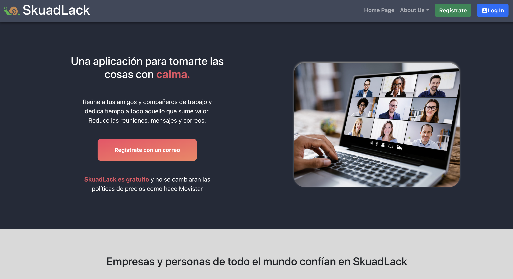
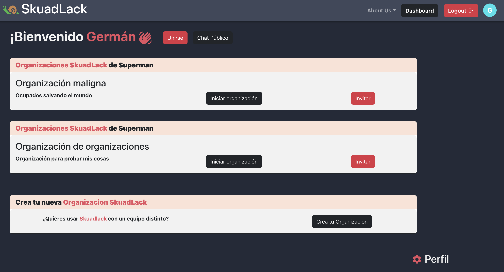
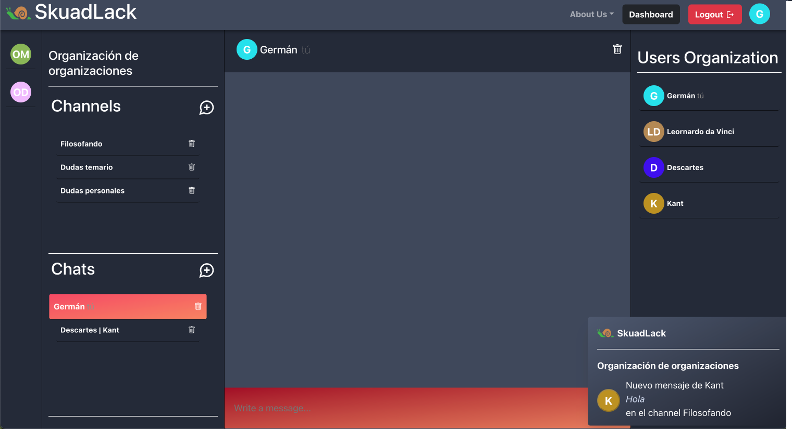
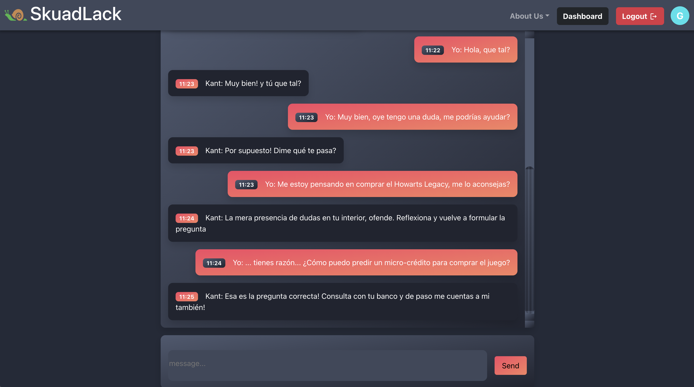
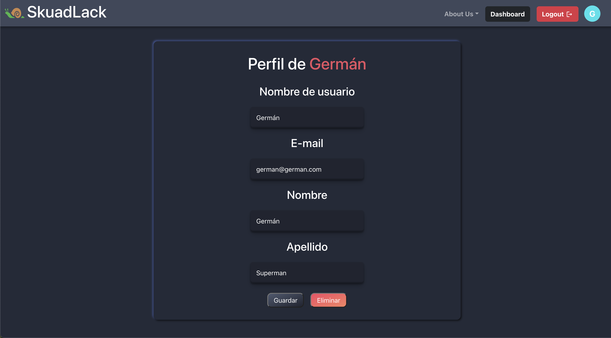
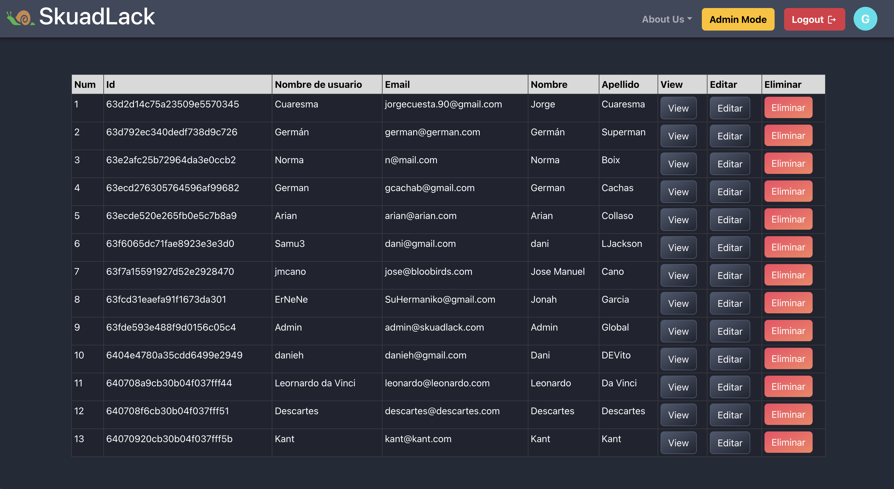

<h1>El origen</h1>

Skuadlack es una aplicación web de chat en tiempo real desarrollada como parte del bootcamp en Nuclio Digital School en el 2022-2023 por parte de alumnos que iniciaron el máster con cero o escasos conocimientos a nivel de programación. 

<h1>Core Business </h1>
SkuadLack es un clon con personalidad propia de Slack que permite la comunicación entre 
organizaciones teniendo la posibilidad de crear chats independientes dentro de los usuarios de una organización o canales temáticos para diferentes usuarios. 
Mediante el sistema de notificaciones y envío de imágenes el usuario tiene las herramientas necesarias para una comunicación fluida y efectiva sin caer en elementos barrocos que pueden desviar la atención del foco principal.

<h1>Principales librerías y tecnologías implementadas: </h1>
<ul>
<li>React (Front-end)</li>
<li>React-router-dom (Front-end)</li>
<li>React-Hook-form (Front-end)</li>
<li>Express (Back-end)</li>
<li>Mongoose (Base de datos)</li>
<li>Socket (cliente y servidor)</li>
<li>Mailgun (envío de mails en base a eventos)</li>
<li>Cloudinary (gestión de imágenes)</li>
<li>JWT (Autenticación y autorización)</li>
  </ul>

<h1>UI</h1>
<h3>Landing page:</h3>

Página inicial que permite, en otras cosas, realizar el login y registrarse en la web para poder acceder al contenido.

<h3>Dashboard del usuario:</h3>

Permite ver todas las organizaciones a las que pertenece el usuario, unirse a otra, modificar sus datos de perfil o acceder al chat público.

<h3>Chat Page:</h3>

Permite chatear con otros usuarios a nivel de chat entre uno o varios usuarios, así como la creación de canales o chats y la navegación por las diferentes entidades (chats, canales y organizaciones). 
En esta página el usuario podrá recibir notificaciones de los otros chats o canales y acceder al contenido mediante la notificación.

<h3>Public Chat:</h3>

Permite chatear todos los usuarios de SkuadLack sin importar su organización. Permite un intercambio libre de conocimiento y opiniones:

<h3>Perfil de usuario:</h3>

Permite cambiar los datos fundamentales del usuario.

<h3>Admin:</h3>

La implementación cuenta con roles que permiten diferenciar los permisos. En este caso, el usuario es GLOBAL_ADMIN por lo que tiene acceso al panel de usuarios para cambiar cualquier dato que a nivel de negocio o soporte, sea necesario

<h1>Puesta en marcha del proyecto:</h1>

<h2>Requisitos previos</h2>
Para ejecutar Skuadlack en tu máquina local, debes tener instalado lo siguiente:
<ul>
	<li>Node.js</li>
  <li>MongoDB</li>
</ul>
  
<h2>Configuración</h2>

<ol>
	<li>Clona este repositorio en tu máquina local:</li>  
	<pre><code>git clone https://github.com/nds-fsd/slack.git</code></pre>
	<li>Navega a Frontend y Backend del proyecto:</li> 
	<pre><code>cd Frontend</code></pre>
  <pre><code>cd Backend</code></pre>
	<li>Instala las dependencias:</li> 
	<pre><code>npm install</code></pre>
	<li>Crea un archivo <code>.env</code> en la raíz del directorio del servidor y agrega las siguientes variables de entorno:</li> 
	<pre>
  <code>
  PORT=3001
  TEST_PORT=3002
  MAILGUN_KEY= []
  MONGO_URL = []
  JWT_SECRET = []
  </code>
  </pre>
	<li>Inicia el servidor(Backend):</li> 
	<pre><code>npm run start:dev</code></pre>
	<li>Abre una nueva terminal y navega al directorio del cliente(Frontend):</li> 
	<li>Inicia el cliente:</li> 
	<pre><code>npm start</code></pre>
	<li>Abre tu navegador web y navega a <code>http://localhost:3000</code> para ver la aplicación.</li> 
</ol>

<h2>Contacto</h2>
Si tienes alguna pregunta o sugerencia sobre Skuadlack, por favor contáctanos a través de <b>skuadlack@gmail.com</b>
